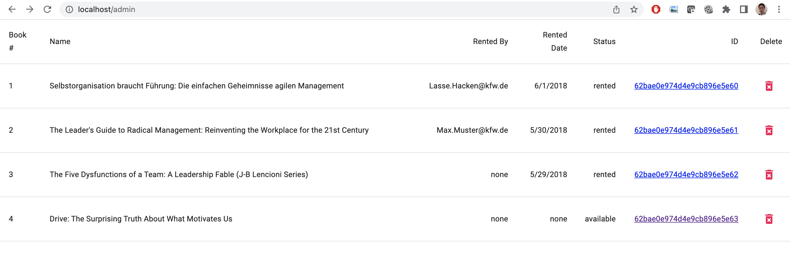

# Application

## Intro

Es handelt sich um eine (ältere) "three-tier" Applikation mit frontend, api, database.
Für diesen Hackathon dient die Applikation nur als Mittel zum Zweck, und die Entwicklung an der Applikation steht hier **nicht** im Fokus. Aus DevOps Sicht ist es trotzdem relevant zu wissen, wie die Architektur der Applikation aussieht und welche Technologien eingesetzt werden, da ihr bei dem Deployment und den Operationstätigkeiten unterstützen sollt.

## Architektur und Verzeichnis Struktur

Im `/application` Verzeichnis findet ihr drei Unterverzechnisse wieder.

- frontend - Das Web Frontend (Presentation Layer) in React geschrieben
- api - Die API (Logik Layer) in Node.js geschrieben
- db-seed - Eine Utility um die Datenbank zu befüllen

Die Datenbank selber ist wie ihr seht nicht als eigenes Verzechnis vorhanden, dass hat den Grund weil es aus Applikations Sicht egal ist wo die Datenbank ist. Gebräuchlich ist dass die Entwickler eine lokale Datenbank, in diesem Fall eine Mongo DB, hochfahren, als ein Container (wird in einer Challenge näher erläutert).

## Frontend

Die Applikation besteht im wesentlichen aus drei Seiten

- `/books` - Übersicht der Bücher und Verleihstatus
- `/books/:bookID` - Detail Seite eines Buches mit Button zum ausleihen und zurückgeben
- `/admin` - Admin Seite um Bücher zu verwalten

# Documentation

> Ihr könnt hier eure Dokumentation zu den Herausforderungen hinzufügen oder euch im Team auf eine eigene Dokumentations Struktur einigen

#ASC

> az acr login --name  lazynerds.azurecr.io

# Docker images in die azure registry pushen:

# FRONTEND
> docker tag 760f546ebf53 lazynerds.azurecr.io/frontend:v1
> docker push  lazynerds.azurecr.io/frontend:v1
> docker pull  lazynerds.azurecr.io/frontend:v1

# API
> docker tag 760f546ebf53 lazynerds.azurecr.io/api:v1
> docker push  lazynerds.azurecr.io/api:v1
> docker pull  lazynerds.azurecr.io/api:v1

# DATABASE
> docker tag 4d9191a01495 lazynerds.azurecr.io/database:v1
> docker push lazynerds.azurecr.io/database:v1
> docker pull lazynerds.azurecr.io/database:v1

# Data for DB
wie die anderen

# Challenge 5
# Führt das Terraform File aus, um die resource group und ACR in der Cloud zu erstellen

Initialisieren von Terraform:
> terraform init

Erstellen des Terraform plans:
> terraform plan -out plan.text

Anwendung des plans:
> terraform apply "plan.text"

Challenge 7

# Turn up projects in azure via docker-compose.webapp.yml instead of
# docker-compose.yml

> docker-compose -f docker-compose.webapp.yml

# Deploy app to internet
> az appservice plan create --name lazyNerdsPlan --resource-group challenge_04_manual --sku B2

> az webapp create --resource-group challenge_04_manual --plan lazyNerdsPlan --name lazyNerdsApp --multicontainer-config-type compose --multicontainer-config-file docker-compose.webapp.yml

